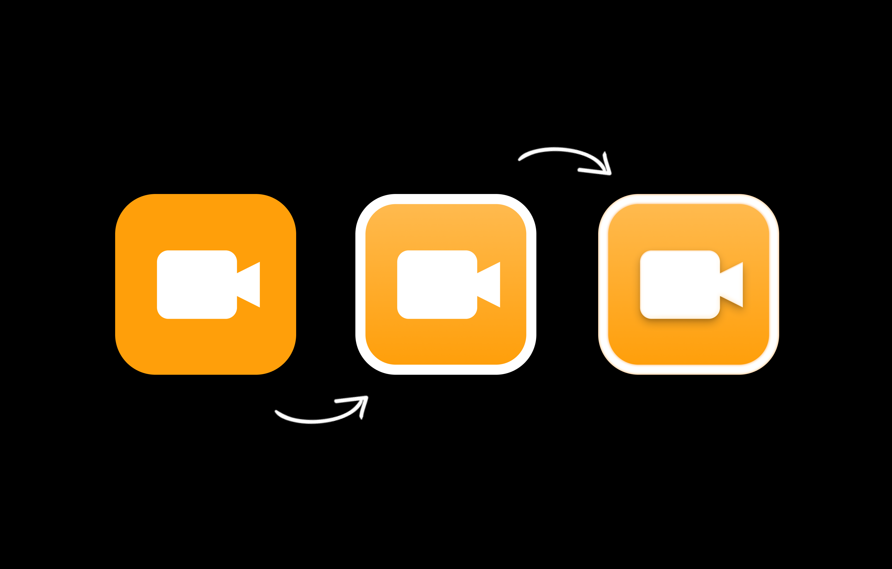

As much as I love flat design, a touch of skeuomorphism really makes things more interesting sometimes.

*Evolution of Hunchat app icon*

Just like any digital designer grown in the age of flat design, when the time came to design my own app from scratch, I didn’t even think twice: “All in on flat design.” And that’s exactly what happened. The app was fully built using only three colors, Helvetica, zero shadows, and the simplest icons I could find. It was perfect! Dieter Rams would have called it the app of the decade!

But then... a few days passed and something started to look off. As a proud creator of this simple masterpiece, I refused to change anything. After some weeks the feeling that the app looked strange became too strong to ignore. Something needed to change.

“Neomorphism must be the answer. Everyone loves it on Dribbble and it looks kind of cool.” - I told myself.

This thought did not last long. After a few tries it became evident that neomorphic was not at all meant to be used on an app whose screens are regularly 90% filled by videos whose colors, contrast, and contrast I can’t control. A design nightmare!

Back to basics then. Three colors, Helvetica, zero shadows, and the simplest icons.

As a UX designer, I looked into the environment in which the app was going to live: iOS. If my app was to be used by the people who are all over the Apple calendar and the weird Apple alarm app, I needed to make things look familiar to them.

Helvetica? More like SF Pro Text.
Simple icons? They only respect SF Symbols.
Zero shadows? The shadows are not very evident, but there is a notion of depth.
Three colors? Sure… But this species also seems to love gradients.

A touch of skeuomorphism.

These were exactly the insights I needed. And they are exactly what the first public version of the app will be made of.

Come on, fellow design junkies, I know you don’t want to miss this. [Download Hunchat](https://hunchat.com).
