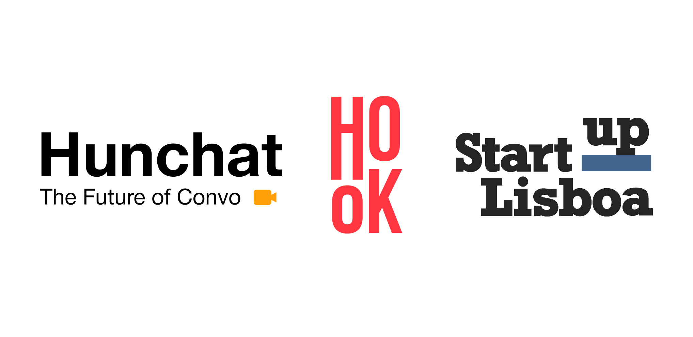

In January, Hunchat was no more than a cool idea in our heads. Fast forward 3 months and we are an incorporated company in two accelerators.

*Logos from Hunchat, Hook and Startup Lisboa.*

At the beginning of the year, [Ernesto](https://www.linkedin.com/in/ernestofgonzalez/) and I set out to build the best place to have meaningful conversations online and called it Hunchat. We knew what our goal was and had a rough idea of the way we wanted to tackle it, but no more than that.

In good startup fashion, we quickly started to sketch ideas, create sample designs and think about the technical implications of what we wanted to build. It turns out, our technical abilities would be enough to get this thing up and running if we dedicated enough time to it, and so we did. Within a few short weeks, we were publicly talking about what we were doing, developing an MVP to test our hypothesis, and looking for help to turn this idea into a viable product.

We are still at the very beginning of this journey, so it feels wrong to say things like “Running a company is much more difficult than just developing a project.” but, even though we are still figuring most of this out, I can safely say that the complexity of having a cool idea is nothing compared to what it takes to turn it into a commercially viable product.

Thankfully, organizations like [Hook](https://hook.vc/) and [Startup Lisboa](https://www.startuplisboa.com/) exist to help us in different, yet equally important ways.

On February the 5th, [Claude Felicité](https://www.linkedin.com/in/cfelicite/) reached out to me asking if I wanted to join the 42 entrepreneurs community. Being already familiar with the 42 environment because of my previous experience at [42 Lisbon](https://www.42lisboa.com/), I immediately accepted. Once inside of this community, Ernesto and I got to know of the existence of Hook: A a 5-month program designed to help founders starting their companies. We carefully filled out the application form and were lucky enough to get invited to the first round of interviews, and then the second and last one after a few days. By the end of both interviews, we were excited yet afraid that what we had would not be thought to make the cut (You are professionals at doing poker faces 😂 , [Kevin](https://www.linkedin.com/in/kevin-primicerio/), [Sydney](https://www.linkedin.com/in/cohensydney/), and [Sixtyne](https://www.linkedin.com/in/pixtyne/)).

We got in! On Friday the 12th, after the second interview, Kevin called to let me know that Hunchat had officially been accepted into the Hook program, meaning that from that point onward we had access to a wide network of amazing people, important workshops, 1-on-1 mentorship, and a SAFE investment of 50.000€ for 5% of our yet to be established company. Needless to say, we were extremely excited about this news.

While all of this was happening, [Fernando Mendes](https://www.linkedin.com/in/now-coworklisboa/), a friend and forever teacher of mine as he says, introduced me by email to [Miguel Fontes](https://www.linkedin.com/in/miguel-fontes-544ba467/), CEO of Startup Lisbon, and I got a chance to pitch Hunchat and schedule a meeting with him and [André Costa](https://www.linkedin.com/in/andresobralcosta/), Head of Strategy at Startup Lisboa, on the second of March. The meeting went really well and we were invited to present in front of the panel of juries that would choose whether we would get accepted or not into the incubation program of Startup Lisboa on the 24th of March.

After the presentation, the juries quickly jumped onto a series of good questions to test our knowledge of the product, market, business plan, etc, and we left without knowing if we were in or not but knowing that we had done all we could.

On March 29th we got an email from [Nuno Moreno](https://www.linkedin.com/in/nunoghmoreno/), Membership manager at Startup Lisboa. We made it!

We then had a meeting with him on April the 1st where we talked about Startup Lisboa, its incubation model, and what the next steps were. We are yet to attend the “welcome session” when the incubation program officially starts.

Startup Lisboa’s method for helping startups is slightly different from Hook’s. First of all, they don’t directly invest in the company, although they will help you reach a large network of angel investors and VCs whenever the timing is right. They function more like a network that is present whenever the startups need them as opposed to Hook, which is a more structured program with various sessions every week. Startup Lisboa also helps in specific questions related to Portugal, whereas Hook’s expertise is in the French environment.

One specific situation where Startup Lisboa would have been helpful to us would be in connecting us to someone with the expertise to make our French investment contract compliant with the Portuguese law. However, we got to meet and work with [Rita Trabulo](https://www.linkedin.com/in/ritatrabulo/), who took care of this exceptionally well. (This happened before we were accepted into the incubation program)

To sum up, Hook’s and Startup Lisboa’s models of incubation are different in some aspects, similar in others, and both extremely helpful.

By now you have probably noticed that there are a lot of names mentioned in this essay, and that’s on purpose. Hunchat is evolving this fast because of the people we get to meet along the way. More than letting you know that we have been accepted into 2 incubation programs, the goal of this essay is to thank all the people who allowed us to be in this position.

Thank you.
