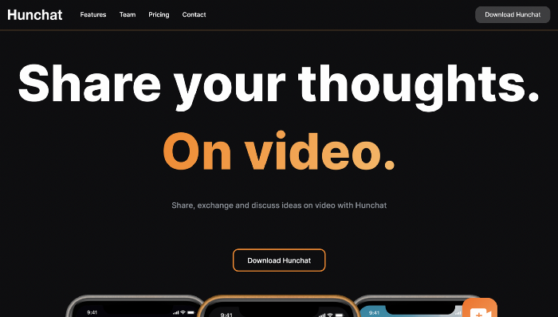

The best way to tell you about Hunchat is to tell you how Ernesto and I — the two co-founders — came up with the idea to create it.

*Hunchat’s landing page on 18/02/2021*

We have always been fans of speaking our minds and having conversations online, and when Twitter released its new feature “fleets”, which are essentially insta-stories, we started to discuss the usefulness and potential of a video-based social platform that focused purely on authentic conversations between its users.

Current social media platforms have problems that introduce friction when trying to maintain a meaningful conversation.

1. The comment format that we are used to is not adequate.
2. The excessive amount of ads is annoying.
3. And the difficulty of separating content by subject makes feeds too noisy.

## Face-to-face is the best way to have conversations, video comes second.

Taking advantage of this, at Hunchat we are creating an **ad-free video-only social platform** that allows you to **share, exchange and discuss ideas with other people**, while also storing and organizing those conversations in topics that are relevant to you.

Content is organized to **optimize meaningful conversations** with your loved ones without everyone having to be online at the same time.

## The timing is right.

Both the need for online communication forced by the pandemic, and the popularity of Tiktok created the behavioral change that a platform like Hunchat needs to thrive. **Most people are now fine with the idea of recording themselves talk**, and there is no social platform that takes advantage of that to make them talk to each other in a convenient way.

We are currently testing the first MVP internally and over 70 people have [signed up](https://hunchat.com/waiting-list) in just 4 days to receive access to the app as soon as we publish it.

Although during the first testing phase, the app will be completely free to use, we are exploring different monetization techniques, with the highlighted ones for now being a freemium model with premium subscriptions.

What’s next for Hunchat?

We are now laser-focused on bringing the first public MVP to life, but also looking into opportunities to expand our team and gather investment to help us grow and reach larger audiences.

Thank you for being here. feel free to ask me or Ernesto any questions and learn more about Hunchat at https://hunchat.com.
