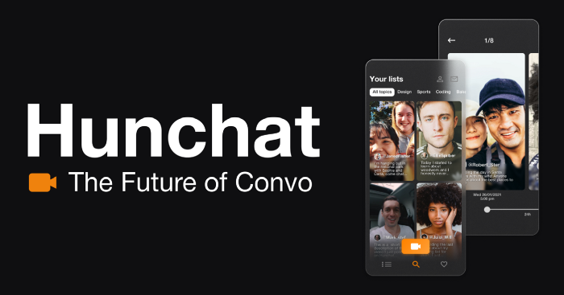

The ways in which we communicate are constantly changing. Not because we evolve as a species, but because the tools we use to communicate with one another are intrinsically flawed and need constant updates.

In a nutshell:

Nothing replaces face-to-face communication.

To understand why our mediums are continually changing and what flaws they are trying to fix we need to look at where all valuable information is: First principles

Humans are a social species. Our communication skills evolved from the need to achieve large scale cooperative endeavors that allowed us to survive centuries of threats caused by stronger predators. Later in our short history, when we eventually built our way to the top of the food chain, our threats went from dealing with lions to dealing with other people.

**Even though realities changed, communication has always been about survivorship. The best way to kill a lion, cure depression, get a job, or pass on your genes is through effective communication.**

Ever since someone had the brilliant idea of painting on the walls, individuals throughout history have been trying to eternalize their messages in different mediums, from sculptures to books, pictures, tweets, videos, and much more.

## Moving beyond face-to-face communication

Face-to-face communication has constraints. Some of which don’t align with the kind of globalized life we desire to achieve in the 21st century.

You can’t talk to someone who is sleeping. But you can send a message.

You can’t be face-to-face with someone who is on the other side of the planet. But **you can send a video of yourself.**

You can’t talk to a million people at the same time. But **you can send a tweet to a million feeds.**

You get the point.

With the aid of technology, we created at least 3 new incredible ways to communicate.

1. Asynchronously;
2. Through videos;
3. One-to-many interactions.

### 1. Asynchronously

The ability to store and distribute a message somewhere opens up an extremely important new way to communicate: Asynchronously.

Asynchronous conversations started with letters and have evolved to DM’s, email, etc… They allow us to speak to others when they are not immediately available and receive their answers even while we sleep.

This feature is especially important if you live a globalized lifestyle and need to interact on a daily basis with others who are in distant time zones. We still cannot defy the laws of physics.

This method of communication also allows for more reflection before responding than any live conversation.

### 2. Through videos

When compressing our communication into any medium, we lose a lot of valuable information that would help us navigate in-person conversations like body language, tone, speed, among others.

Video (with audio) allows us to keep a lot of that information and avoids the loss of meaning in the exchange of words between two people who are physically apart. Sure, we are not able to recreate the smell of the other person yet, but we are capable of reproducing the other person’s tone of voice, facial expression, body language, and pronunciation, all of which will help us immensely when deciphering their messages.

It is safe to say that video communication is the kind of distance communication that carries the most amount of meaning.

### 3. One-to-many interactions

You want to invite 1000 people to a party. Will you talk personally to 1000 people or will you create some sort of group and communicate with all of them with just 1 message?

Because we tend to operate in groups it is normal to have one-to-many interactions where the “many” might not all be in the same place at the same time. Being able to interact with an almost infinite amount of people at the same time is a defining characteristic of this era, and an important one. These one-to-many interactions ease the process of achieving the previously mentioned goal of mass cooperation.

## Flaws in the system

Our natural communication skills and habits have evolved for millions of years and a bunch of trial and error. With this in mind, we can easily predict that any new form of non-natural communication we try to create will be fragile and flawed.

How many times have you switched between messaging apps? Remember SMS? Is Myspace still a thing? For how long will you keep on using Facebook? Will your grandchildren know what “tweets” are?

There is not a single platform that takes advantage of all three new types of communication (asynchronous, video, one-to-many) without making some kind of major compromise.

Let’s take Youtube as an example.

Youtube is a great platform that utilizes all of these 3 types of communication but then serves the content in a way that feels like a lecture instead of a conversation. Sure, the viewers can comment on the videos and get their points across, but they are not given nearly as much leverage as the video creator. Tiktok presents a different version of the same concept, where you are given content to consume and the option to create your own, but it is never optimized to encourage conversations.

We will always want to have conversations. Platforms should optimize for that.

## It is time for something new

By now, social platforms have matured enough for us to move to a space that prioritizes conversations over anything else.

This is why I am joining forces with Ernesto to build Hunchat.

Hunchat is a social media platform that allows you to have meaningful video conversations.

By using a video-first approach and a thread system similar to those found on Twitter or Reddit, this new platform takes online conversations to the next level by allowing people to chat with each other in threads (we call them convos) of videos. Everyone in the app has the same leverage, whether they are starting an original conversation or jumping in on one, following the trend that we are seeing from users evolving from passive consumers to commentators, to content creators themselves.

This user-focused design retains the warm feeling of one-to-one interactions while also having the advantages of one-to-many since other people can join at any time and follow the conversation in their own path. At the same time, this mixture between asynchronous communication and video avoids the loss of reflection present in real-time media while keeping the dynamism and interactivity of live conversations.

Building the future of online conversations.

It is definitely a big project we have on our hands.

https://hunchat.com

Follow us on Twitter at [@gethunchat](https://twitter.com/GetHunchat)
